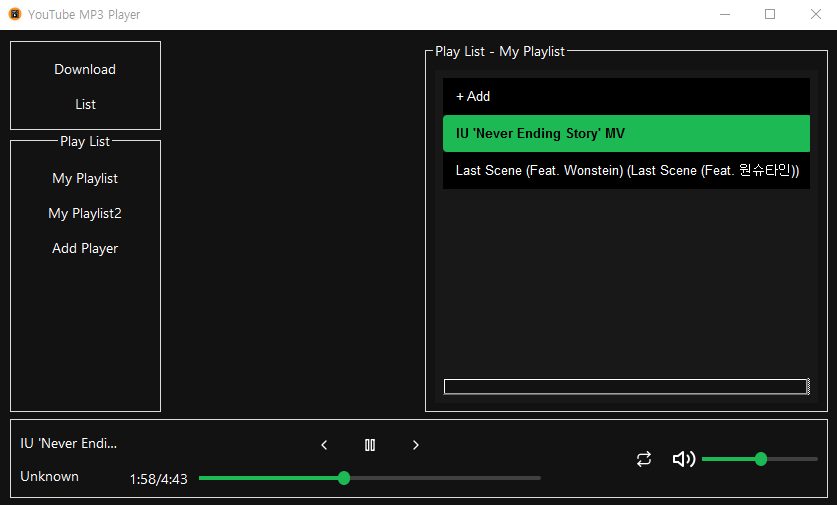

# 🎧 MP3 Player - PySide6 GUI

**PySide6를 기반으로 한 데스크탑 MP3 플레이어입니다.**  
음악을 검색해 다운로드하고, 직접 구성한 플레이리스트를 재생할 수 있습니다.

  

## 🖼️ 주요 화면 구성

### 🪟 MainWindow (메인 플레이어 화면)

**음악 다운로드 및 재생을 위한 메인 인터페이스입니다.**

#### 🎛 좌측 사이드바 (`sidebarLayout`)
- 🔽 **Download 버튼**  
  → YouTube 검색 및 다운로드 창(`QDialog`) 실행
- 📃 **List 버튼**  
  → 다운로드된 전체 음악 목록 확인
- 🎧 **PlayList 버튼**  
  → 사용자가 직접 구성한 재생 목록 보기

#### 🎵 음악 정보 영역 (`songInfoLayout`)
- 현재 재생 중인 곡의 **제목 / 아티스트 / 앨범 이미지** 표시
- `musicList`를 통해 현재 재생 중인 플레이리스트 목록 확인

#### ⏯ 재생 컨트롤 영역 (`activityLayout`)
- 현재 재생 곡 정보 (`nowTitleLabel`, `nowArtistLabel`)
- 이전 / 재생 / 다음 곡 제어 버튼
- 재생 시간 및 진행 슬라이더
- 전체 반복 / 한 번 재생 토글 버튼
- 볼륨 조절 슬라이더 및 아이콘

### 📥 DownloadDialog (`QDialog`)

YouTube 음악 검색 및 다운로드를 위한 팝업 창입니다.

- 🔍 `searchEdit` + `searchBtn`으로 유튜브 키워드 검색
- 📜 `listView`에 검색 결과 5~10개 표시  
  - 썸네일  
  - 제목  
  - 업로드 날짜
- 🎯 리스트 아이템 더블 클릭 시 → **MP3 다운로드 시작**

## 📦 주요 기능 흐름

### ① 유튜브 검색 & 다운로드
- `Download` 버튼 클릭 → `DownloadDialog` 실행
- 검색 결과(썸네일 + 제목 + 날짜) 가져오기
- 선택한 영상 → MP3 다운로드
- 다운로드된 음악은 자동으로 플레이어에 등록

### ② 음악 재생 및 리스트 관리
- 음악 리스트에서 선택 시 재생 시작
- 시크바, 볼륨, 반복, 일시정지 등 다양한 재생 제어 가능
- 재생 중인 곡의 메타 정보 및 시간 표시

### ③ 플레이리스트 구성
- 사용자가 원하는 곡만 골라 `PlayList`로 구성
- 리스트 순서대로 자동 재생 지원

## 🛠 기술 스택

- **Python 3.x**
- **PySide6** (Qt for Python)
- **QMediaPlayer** (로컬 MP3 재생)
- **QListView + QAbstractListModel** (검색 결과 표시)
- **QListWidget** (재생 목록 관리)
